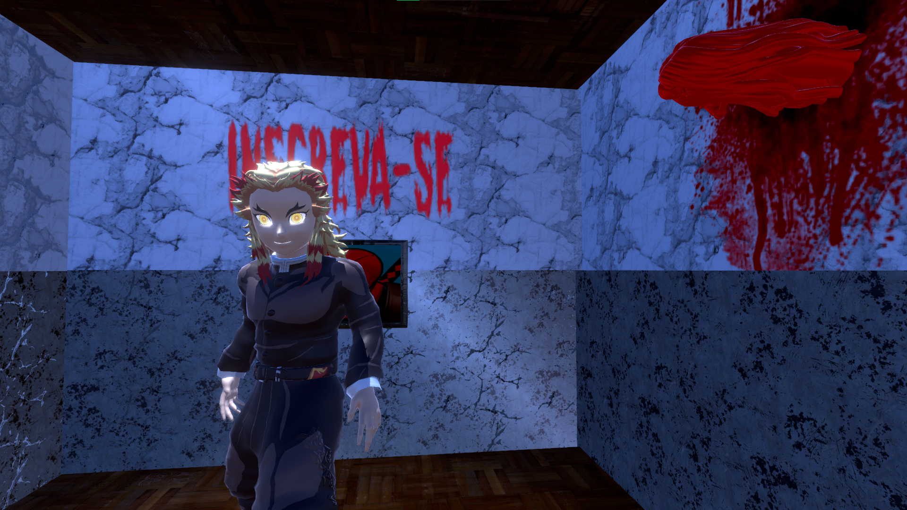
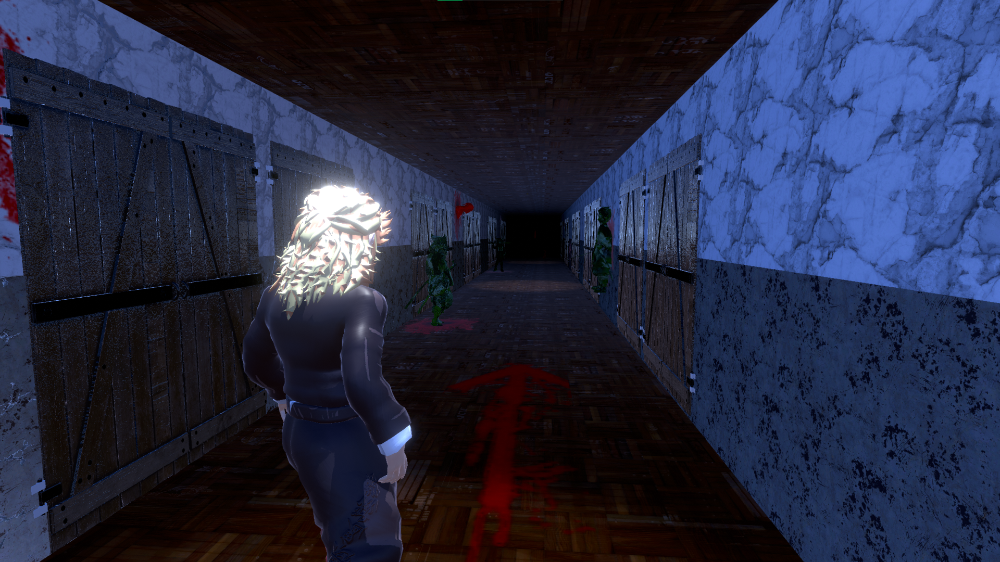
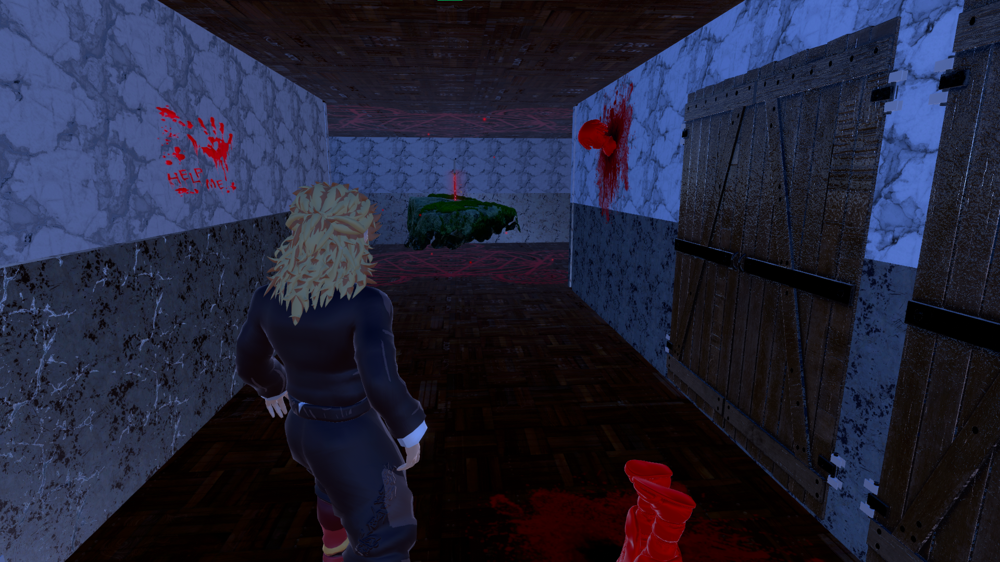
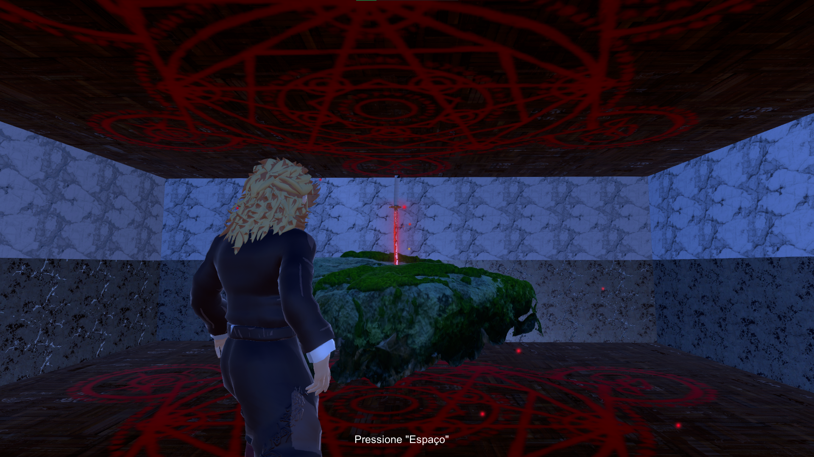
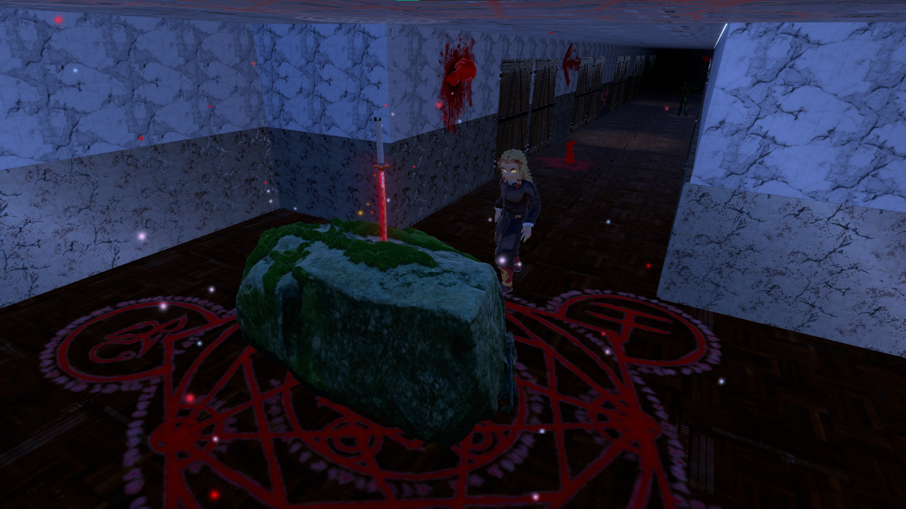
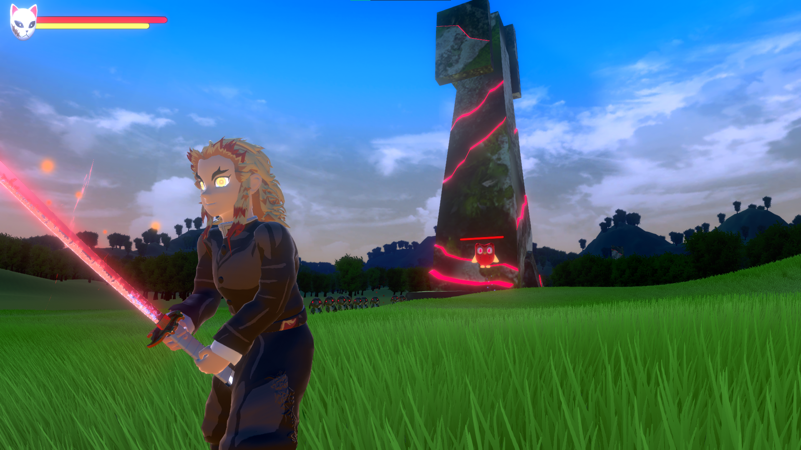

# Haunted-Mansion

**Haunted Mansion** é um jogo meme criado para diversão! Um jogo cheio de humor e momentos hilários, onde você se aventura em uma mansão assombrada, enfrentando o principal vilão, o **Duolingo**, e explorando o personagem principal, o **Kyojuro Rengoku**, o Hashira da Chama (de *Demon Slayer*).

## Como Jogar

1. **Baixe o arquivo .rar ou clone este repositório**: Vá até a seção de releases do repositório e baixe o arquivo compactado com o executável do jogo.
3. **Extraia o arquivo**: Após baixar, extraia o arquivo .rar em uma pasta de sua preferência usando um programa como WinRAR ou 7-Zip.
4. **Execute o jogo**: Dentro da pasta extraída, localize o executável e dê um duplo clique para começar a diversão!

## Screenshots

Aqui estão algumas imagens para você ter uma ideia do visual e da diversão do jogo:

*Tela inicial do jogo*

*Momento emocionante durante a jogabilidade*

*Explorando a mansão com Kyojuro Rengoku*

*Templo com a katana*

*Cutscene obtendo a katana*

*Enfrentando o temido vilão Duolingo!*

### Objetivo do Jogo

O objetivo principal é sobreviver, enquanto enfrenta o vilão **Duolingo** e conta com a ajuda do nosso herói, **Kyojuro Rengoku**, o Hashira da Chama! Prepare-se para momentos de tensão e risadas ao longo do caminho!

## Controles do Jogo

Aqui estão os controles que você vai usar para se aventurar pela mansão:

- **W**: Mover para frente
- **A**: Mover para a esquerda
- **S**: Mover para trás
- **D**: Mover para a direita
- **Space**: Interagir com objetos
- **Shift (esquerdo)**: Correr
- **Esc**: Sair o jogo
- **Clique direito do mouse**: Atacar

## Requisitos do Sistema

- **Sistema Operacional**: Windows, Linux e Mac (não testado em Linux, e Mac)
- **Espaço em Disco**: Aproximadamente 200 MB

## Contatos

Se você tiver alguma dúvida, sugestão ou feedback, sinta-se à vontade para abrir uma *issue* no repositório ou entrar em contato comigo diretamente.
